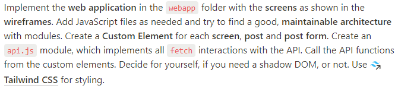

1. Open the folder in your code editor, start a terminal and run docker compose up to build and start the API.
2. Visit http://localhost:3000 and create a few users and posts.
3. Visit http://localhost:4000 to open up the webapp. 
